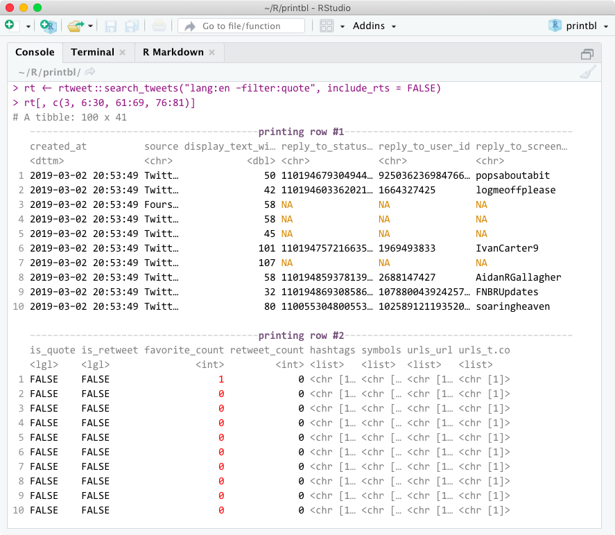
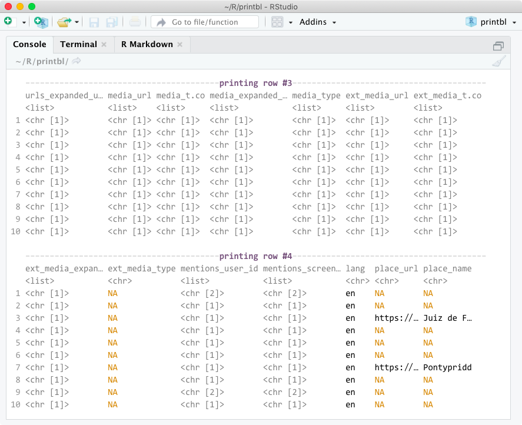
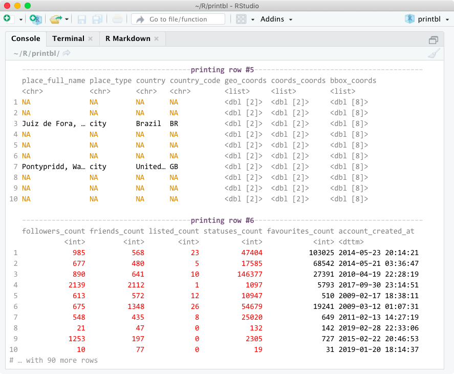

<!-- README.md is generated from README.Rmd. Please edit that file -->

```{r setup, include = FALSE}
knitr::opts_chunk$set(echo = TRUE, collapse = TRUE, comment = "#>")
#options(width = 100)
```
# printbl

<!--[](https://travis-ci.org/mkearney/printbl)
[](https://cran.r-project.org/package=printbl)
[](https://codecov.io/gh/mkearney/printbl?branch=master)

#
#-->
[](https://www.tidyverse.org/lifecycle/#experimental)

> Printable Tibbles

## Installation

Install the development version from Github with:

``` r
## install remotes pkg if not already
if (!requireNamespace("remotes")) {
  install.packages("remotes")
}

## install from github
remotes::install_github("mkearney/printbl")
```

### Problem

A limitation of tibble printing is that variables are hidden if they cannot fit
within the device's width. 

### Solution

**{printbl}** solves this problem via **printing rows**. This means users get to 
preview ALL of the data while preserving the pretty printing behaviors of tibbles.

## Example

```{r, eval=FALSE}
## load {printbl} package
library(printbl)

## generate a data frame with lots of variables
rt <- rtweet::search_tweets("lang:en -filter:quote", include_rts = FALSE)

## print non-ID columns
rt[, c(3, 6:30, 61:69, 76:82)]
```

<p align="center">
  
</p>

<p align="center">
  
</p>

<p align="center">
  
</p>

